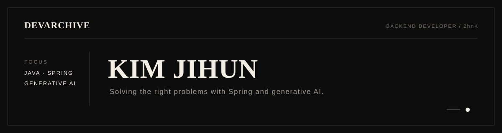

  

  
  
  

## 01. About

안녕하세요, 김지훈입니다. 
Spring 기반 백엔드와 생성형 AI 응용 서비스를 만들고 있습니다. 
조금은 느리더라도 문제의 본질을 놓치지 않는 개발자가 되겠습니다.

## 02. Featured Work

### iRead

시선·발음 데이터를 활용한 **난독증 아동 맞춤형 읽기 훈련 시스템**

`Eye Tracking` · `Generative AI` · [Repository](https://github.com/iRead-B105/iRead)

### Soomgil

생성형 AI와 공공데이터를 활용한 **취향 기반 여행 협업 플랫폼**

`Generative AI` · `Public Data` · [Repository](https://github.com/Soomgil/soomgil)

### Dyslexia AI Kit

난독증 아동·청소년을 위한 **AI 교안 생성 서비스**

[Frontend](https://github.com/2hnK/dyslexia-kit-frontend) · [Backend](https://github.com/2hnK/dyslexia-kit-backend) · [AI](https://github.com/2hnK/dyslexia-kit-ai)

### NLP Character Feature Extraction

Qwen3-VL 기반 **캐릭터 특성 추출 및 커플 매칭 예측 시스템**

`Qwen3-VL` · `Vision Language Model` · [Repository](https://github.com/2hnK/NLP-Character-feature-extraction)

## 03. Technical Focus

- **Backend** · `Java` `Spring` `Spring AI` `JPA` `MyBatis`
- **AI** · `Python` `LangChain`
- **Data** · `MySQL` `PostgreSQL` `Redis`
- **Frontend** · `Vue`
- **Infrastructure** · `Docker` `AWS`

## 04. Highlights

### 삼성청년SW/AI아카데미(SSAFY)

`2026.01 — 현재`

- `2026.06.26` **SSAFY 1학기 프로젝트 우수상** 
  생성형 AI와 공공데이터를 활용한 Soomgil 서비스
- `2026.05 — 2026.10` **2026 관광데이터 활용 공모전** 
  웹·앱 개발 부문 참가

### 국립한밭대학교 컴퓨터공학과

`2024.03 — 2026.02`

- `2026.02` **컴퓨터공학 학사 졸업**
- `2026.02` **KICS 동계종합학술발표회 장려상** 
  비용효율적인 지능형 AICC를 위한 자가진화형 4계층 정규화 게이트 연구 발표
- `2025.05` **교내 소중한 SW·AI 경진대회 SW 부문 1등** 
  난독증 아동을 위한 AI 교안 생성 서비스

### Certifications

- `2025.09` **정보처리기사** · 한국산업인력공단
- `2025.06` **SQLD** · 한국데이터산업진흥원

## 05. GitHub & Problem Solving

## 06. GitAnimals Farm

